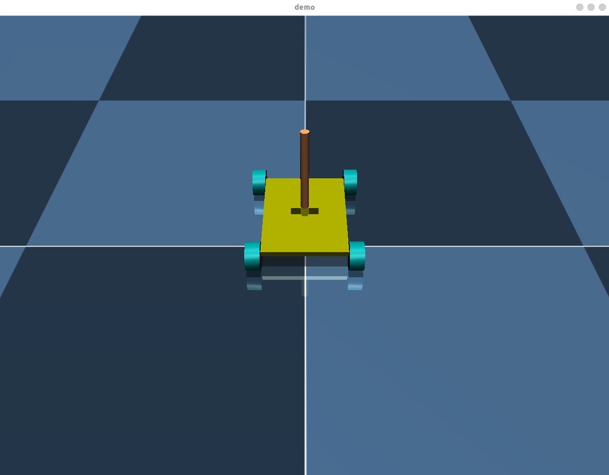

# Mujoco Inverted Pendulum
> a inverted pendulum based on mujoco

## Requirements

* ROS1
* Mujoco (version > 2.3) 
    * [release_tag](https://github.com/google-deepmind/mujoco/releases/tag/2.3.7)
* OpenGL 
    ```
    sudo apt-get install build-essential
    sudo apt-get install build-essential libgl1-mesa-dev
    sudo apt-get install libglew-dev libsdl2-dev libsdl2-image-dev libglm-dev libfreetype6-dev
    sudo apt-get install libglfw3-dev libglfw3
    ```
* Qsqp Eigen
    * https://github.com/robotology/osqp-eigen

## Build

```bash
mkdir -p ros_ws/src
cd ros_ws/src/
git clone ...
cd ..
catkin_make
```

## Description

This project is organized by a CMakeLists file.

```
.
├── CMakeLists.txt                      # the root CMakeList
├── include                         
│   ├── control                         # the control models
│   │   ├── controller_base.h
│   │   ├── mpc_controller.h
│   │   └── pid_controller.h
│   ├── inverted_pendulum_simulator     # the pendulum simulator
│   │   ├── inverted_pendulum.h
│   │   └── mujoco_viewer.h
│   └── mpc_solver                      # the mpc solver
│       ├── mpc_solver.h
│       └── mpc_solver.tpp
├── package.xml
├── src
│   ├── inverted_pendulum.cpp
│   ├── mpc_controller.cpp
│   ├── mujoco_view.cpp
│   ├── pid_controller.cpp
│   └── simulator.cpp               
└── urdf
    ├── inverted_pendulum.xml           # the pendulum model
    └── meshes                          # the mesh files of the model
```

## Run

```bash
source devel/setup.bash
rosrun inverted_pendulum_simulator simulator
```

If the program run successfully, you will see the inverted pendulum working like this.

